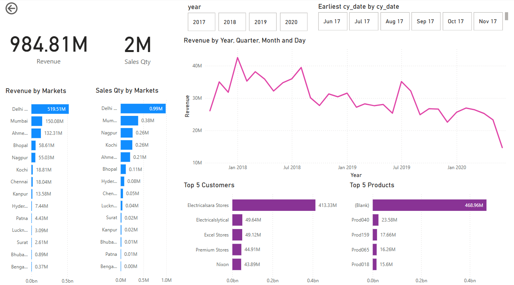

# Sales Insight Dashboard

This repository contains a Power BI dashboard that provides insights into sales data. The dashboard helps in understanding sales performance, identifying trends, and making data-driven decisions.

## Dashboard Overview

The Sales Insight Dashboard includes the following key sections:

1. **Sales Performance**: Visualizes overall sales performance over time.
2. **Top Products**: Highlights the best-selling products.
3. **Sales by Region**: Shows sales distribution across different regions.
4. **Customer Insights**: Provides information about customer demographics and behavior.

## Key Insights

### Sales Performance

- **Trend Analysis**: The sales performance section shows a clear trend of sales over time, helping to identify peak periods and seasonal variations.
- **Growth Rate**: The dashboard calculates the growth rate, allowing for quick assessment of sales performance compared to previous periods.

### Top Products

- **Best Sellers**: This section highlights the top-selling products, providing insights into which products are driving the most revenue.
- **Product Categories**: It also breaks down sales by product categories, helping to identify which categories are performing well.

### Sales by Region

- **Regional Distribution**: The sales by region section shows how sales are distributed across different geographical areas.
- **Regional Performance**: It helps in identifying high-performing regions and areas that need improvement.

### Customer Insights

- **Demographics**: This section provides insights into customer demographics such as age, gender, and location.
- **Customer Behavior**: It also includes information about customer purchasing behavior, helping to understand customer preferences and trends.

## How to Use

1. **Clone the Repository**: Clone this repository to your local machine using `git clone https://github.com/yourusername/sales-insight.git`.
2. **Open Power BI**: Open the Power BI Desktop application.
3. **Load Data**: Load your sales data into Power BI.
4. **Import Dashboard**: Import the provided Power BI dashboard file into your Power BI Desktop.
5. **Customize**: Customize the dashboard as needed to fit your specific requirements.

## Power BI Dashboard Link

You can view the Power BI dashboard online [here](https://app.powerbi.com/links/DaMmPk68xV?ctid=168c05fc-dcc7-4aa8-ae05-6c848fe9cfac&pbi_source=linkShare).

## Conclusion

The Sales Insight Dashboard is a powerful tool for analyzing sales data and making informed business decisions. By providing clear visualizations and key insights, it helps in understanding sales performance, identifying trends, and optimizing sales strategies.

